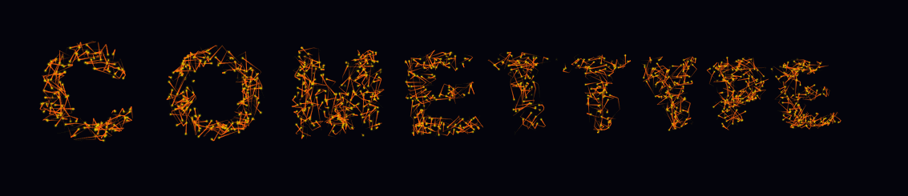
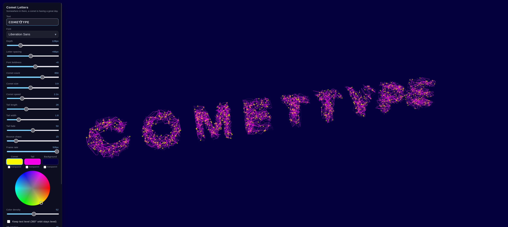

# Comettype

Comettype turns whatever you type into 3D block letters made of light. The letter shapes themselves are invisible. What you see is a swarm of small comets bouncing around inside them, and their trails are what draw the word. You can spin the word in 3D, restyle every part of it, and export the result as a seamlessly looping animated GIF.

**Open it here and start typing: [potncoffee.github.io/comettype](https://potncoffee.github.io/comettype/)**

The whole program is a single HTML file. There is nothing to install, no account to create, and no server behind it. Opening the link above runs it in your browser. You can also download the file and use it on your own computer with no internet connection, because it loads nothing from outside itself.

The panel in the screenshot is titled Comet Letters, which was the working name while it was being built.

## Two ways to run it

**On the web.** Go to [potncoffee.github.io/comettype](https://potncoffee.github.io/comettype/). That is all.

**On your own computer.** Download [comettype.html](https://github.com/potncoffee/comettype/releases/latest/download/comettype.html) from the latest release and double-click it. It opens in your default browser and works the same as the web version, online or off. The file named `index.html` in this repository is the same program. It carries that name because GitHub needs it in order to serve the page.

## How to use it

1. Type in the **Text** box. The letters rebuild a moment after you stop typing.
2. Drag anywhere on the dark area to orbit around the word. Scroll to zoom.
3. Move the sliders in the panel on the left. Every change shows up immediately.
4. Click one of the three color swatches, then pick a color on the wheel.
5. When you like what you see, check **Loop mode**, click **Export GIF…**, and then **Render GIF**.

The panel scrolls if it is taller than your window. **Hide panel** tucks it away and centers the word in the full window, and the ☰ button brings it back. A different one-line greeting appears under the title each time you open the page.

## What every control does

### The letters

| Control | Range | Starts at | What it does |
|---|---|---|---|
| Text | up to 40 characters | DYNAMIC TEXT | The word or phrase to draw. |
| Font | dropdown | Liberation Sans | Picks the typeface. Each name in the list is written in its own font. |
| Depth | 10 to 500 | 170 | How thick the letters are from front to back. The comets use all of that space. |
| Letter spacing | -80 to +240 | 0 | Pushes letters apart or pulls them together. Letters that overlap merge into one chamber the comets can cross. |
| Font boldness | -56 to +60 | 0 | Thins or fattens the strokes of whatever font is chosen. |

### The comets

| Control | Range | Starts at | What it does |
|---|---|---|---|
| Comet count | 40 to 1200 | 360 | How many comets fill the word. More comets make the letters easier to read. |
| Comet size | 0.5 to 8 | 2.6 | The width of each comet's head. |
| Comet speed | 0 to 8 | 2.2 | How fast the comets travel. Zero freezes them in place. |
| Bounce chaos | 0 to 100 | 15 | How much a comet's direction is scrambled when it hits a wall. Zero gives clean mirror bounces. High values look like a swarm. |

### The tails

| Control | Range | Starts at | What it does |
|---|---|---|---|
| Tail length | 4 to 70 | 28 | How long a trail each comet leaves. |
| Tail width | 0.2 to 8 | 1.8 | How wide the tail is where it meets the comet. It narrows to a point at the far end. |
| Tail fade | 0 to 100 | 50 | How quickly the tail turns transparent toward its tip. Low values keep it solid for most of its length. |

Comet size and Tail width use the same unit, so the two numbers can be compared directly. When the tail is wider than the comet, the tail color wraps around the comet's top, bottom, and front as an outline.

### Playback

| Control | Range | Starts at | What it does |
|---|---|---|---|
| Frame rate | 5 to 50 | 50 | How many pictures per second are drawn. Lower values look choppier but the comets do not slow down. This setting also sets the frame rate of an exported GIF. |

### Color

Three swatches sit above the color wheel, one each for the comet, the tail, and the background. Click a swatch to choose which of the three you are editing. The highlighted swatch is the one the wheel changes.

On the wheel, the direction from the center sets the hue and the distance from the center sets how vivid the color is. The **Color density** slider below it runs from 0 to 100. Low values give pale, airy color and high values give deep, dark color.

Each swatch has a **transparent** checkbox under it. Checking it under Comet hides the comet heads and leaves only the tails. Checking it under Tail hides the tails and leaves only the heads. Checking it under Background removes the background. On screen a checkerboard shows through, and an exported GIF has a truly transparent background.

### The camera

| Control | What it does |
|---|---|
| Drag | Orbits around the word in any direction. |
| Scroll | Zooms in and out. |
| Keep text level | On by default. Holds the line of text level on screen while you orbit, so the word never looks tilted. |
| 2D rotation | Spins the whole picture like a photo on a table, from -180 to +180 degrees. Positive is clockwise. Moving this slider switches Keep text level off, and checking that box again sets the rotation back to zero. |
| Disk rotation | Turns the word as if it were standing on a level turntable, from -180 to +180 degrees. |
| Slow auto-orbit | Turns the camera around the word continuously. |
| Reset camera | Returns to the straight-on view at the starting zoom, with both rotations at zero and Keep text level on. |

### Looping

**Loop mode (seamless)** makes the animation repeat with no visible jump. **Loop length** sets how long one pass lasts, from 1 to 15 seconds in half-second steps, and starts at 3.

It works by giving every comet its own repeating path of exactly that length. Each comet replays the same route and the same bounces every time. The comets are staggered so they do not all restart at once, and each one fades out and back in at the ends of its own route. The picture at the end of a loop therefore matches the picture at the start.

## Exporting an animated GIF

Click **Export GIF…** to open the export box. It has four fields.

| Field | What it does |
|---|---|
| Width px and Height px | The size of the finished GIF. They start at the size the animation has on your screen, cropped tight around the letters. The two are linked. Change one and the other follows, so the picture keeps its shape. |
| Margin px | Empty space around the animation, the same on all four sides. It starts at 2. |
| File name | Suggested from your text. Edit it before you render if you want a different name. |

Click **Render GIF**. A frame counter runs while the file is built, and then your browser saves it to your downloads folder.

The GIF holds exactly one pass of the loop and is set to repeat forever. The number of frames is the frame rate multiplied by the loop length, so 50 frames per second for 3 seconds gives 150 frames. If Loop mode is off when you render, it is switched on for you. The GIF at the top of this page is 150 frames at 1133 by 245 pixels and came out at 6.4 MB.

## Things worth knowing

- **Fonts depend on your computer.** The font list was made from the 262 font families installed on the Linux machine the program was built on. A font you do not have installed shows up as a plain bold typeface instead.
- **Stop the auto-orbit before you export.** Camera movement is not part of the loop. If Slow auto-orbit is on, or you drag the view while a GIF is rendering, the export will not loop cleanly.
- **GIFs are limited to 256 colors.** The colors are chosen from the first frame of the animation. Soft glows can look slightly banded compared with what is on screen.
- **GIF transparency is all or nothing.** A pixel in a GIF is either fully see-through or fully solid. With a transparent background, the soft glow around each comet gets a hard edge.
- **50 frames per second is the ceiling.** The GIF format stores timing in hundredths of a second, which makes 50 the fastest rate it can hold. The page is capped at 50 so that the screen and the export agree. Some in-between settings are rounded to the nearest rate a GIF can store, so 30 plays at about 33.
- **Large exports take time and space.** File size and rendering time grow with the pixel size, the frame rate, and the loop length together.
- **Nothing is saved between visits.** The page opens with its starting settings every time.
- **Tested in Firefox on Linux.** It uses only standard browser features, but other browsers have not been checked.
